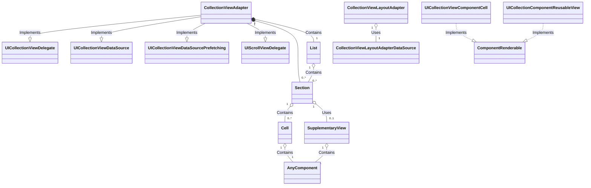
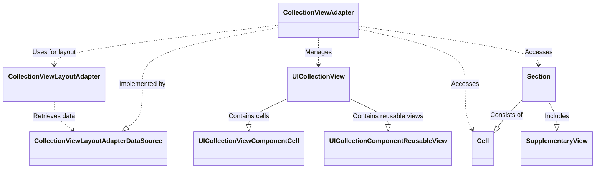

### Event/List/WillEndDraggingEvent.swift

### 1. 모든 클래스와 구조체의 표

| 구분 | 이름 | 설명 |
| --- | --- | --- |
| class | UICollectionViewComponentCell | 컬렉션 뷰의 셀을 관리하는 클래스 |
| class | UICollectionComponentReusableView | 컬렉션 뷰의 재사용 가능한 뷰를 관리하는 클래스 |
| class | CollectionViewAdapter | 컬렉션 뷰와 데이터와의 어댑터 역할을 하는 클래스 |
| class | CollectionViewLayoutAdapter | 컬렉션 뷰 레이아웃과 데이터소스 간의 어댑터 역할을 하는 클래스 |
| struct | Section | 섹션 데이터와 이벤트를 관리하는 구조체 |
| struct | Cell | 셀 데이터와 이벤트를 관리하는 구조체 |
| struct | List | 전체 리스트 데이터를 관리하는 구조체 |
| struct | SupplementaryView | 헤더 또는 푸터와 같은 보조 뷰를 관리하는 구조체 |
| struct | NextBatchTrigger | 페이징을 위한 트리거 관리 구조체 |
| protocol | Component | 컴포넌트 인터페이스를 정의한 프로토콜 |
| protocol | CollectionViewLayoutAdaptable | 컬렉션 뷰 레이아웃을 관리하는 프로토콜 |
| protocol | CollectionViewLayoutAdapterDataSource | 컬렉션 뷰 데이터 소스를 관리하는 프로토콜 |
| protocol | ComponentRenderable | 컴포넌트를 렌더링하는 인터페이스를 제공하는 프로토콜 |

### 2. 중요한 Class 및 Struct 순서
1. **CollectionViewAdapter**
2. **CollectionViewLayoutAdapter**
3. **Section**
4. **List**
5. **Cell**
6. **UICollectionViewComponentCell**
7. **UICollectionComponentReusableView**
8. **SupplementaryView**
9. **NextBatchTrigger**

### 3. 소제목: Class 구현 관계

### 4. 소제목: Class 호출 관계

위 다이어그램은 주어진 구조에서 클래스와 구조체들이 어떻게 상호 작용하는지 표시합니다. Each arrow represents a call or a dependency, making it easier to understand the software architecture.

