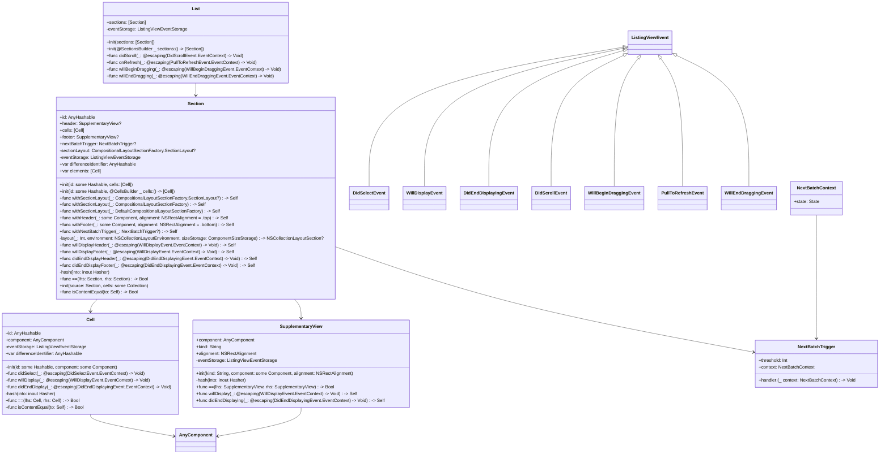

### Event/List/WillEndDraggingEvent.swift

```mermaid
classDiagram
    class Cell {
        +id: AnyHashable
        +component: AnyComponent
        -eventStorage: ListingViewEventStorage
        +init(id: some Hashable, component: some Component)
        +func didSelect(_: @escaping (DidSelectEvent.EventContext) -> Void)
        +func willDisplay(_: @escaping (WillDisplayEvent.EventContext) -> Void)
        +func didEndDisplay(_: @escaping (DidEndDisplayingEvent.EventContext) -> Void)
        -hash(into: inout Hasher)
        +func == (lhs: Cell, rhs: Cell) -> Bool
        +var differenceIdentifier: AnyHashable
        +func isContentEqual(to: Self) -> Bool
    }
    class List {
        +sections: [Section]
        -eventStorage: ListingViewEventStorage
        +init(sections: [Section])
        +init(@SectionsBuilder _ sections: () -> [Section])
        +func didScroll(_: @escaping (DidScrollEvent.EventContext) -> Void)
        +func onRefresh(_: @escaping (PullToRefreshEvent.EventContext) -> Void)
        +func willBeginDragging(_: @escaping (WillBeginDraggingEvent.EventContext) -> Void)
        +func willEndDragging(_: @escaping (WillEndDraggingEvent.EventContext) -> Void)
    }
    class Section {
        +id: AnyHashable
        +header: SupplementaryView?
        +cells: [Cell]
        +footer: SupplementaryView?
        +nextBatchTrigger: NextBatchTrigger?
        -sectionLayout: CompositionalLayoutSectionFactory.SectionLayout?
        -eventStorage: ListingViewEventStorage
        +init(id: some Hashable, cells: [Cell])
        +init(id: some Hashable, @CellsBuilder _ cells: () -> [Cell])
        +func withSectionLayout(_: CompositionalLayoutSectionFactory.SectionLayout?) -> Self
        +func withSectionLayout(_: CompositionalLayoutSectionFactory) -> Self
        +func withSectionLayout(_: DefaultCompositionalLayoutSectionFactory) -> Self
        +func withHeader(_: some Component, alignment: NSRectAlignment = .top) -> Self
        +func withFooter(_: some Component, alignment: NSRectAlignment = .bottom) -> Self
        +func withNextBatchTrigger(_: NextBatchTrigger?) -> Self
        -layout(_: Int, environment: NSCollectionLayoutEnvironment, sizeStorage: ComponentSizeStorage) -> NSCollectionLayoutSection?
        +func willDisplayHeader(_: @escaping (WillDisplayEvent.EventContext) -> Void) -> Self
        +func willDisplayFooter(_: @escaping (WillDisplayEvent.EventContext) -> Void) -> Self
        +func didEndDisplayHeader(_: @escaping (DidEndDisplayingEvent.EventContext) -> Void) -> Self
        +func didEndDisplayFooter(_: @escaping (DidEndDisplayingEvent.EventContext) -> Void) -> Self
        -hash(into: inout Hasher)
        +func == (lhs: Section, rhs: Section) -> Bool
        +var differenceIdentifier: AnyHashable
        +var elements: [Cell]
        +init(source: Section, cells: some Collection<Cell>)
        +func isContentEqual(to: Self) -> Bool
    }
    class SupplementaryView {
        +component: AnyComponent
        +kind: String
        +alignment: NSRectAlignment
        -eventStorage: ListingViewEventStorage
        +init(kind: String, component: some Component, alignment: NSRectAlignment)
        -hash(into: inout Hasher)
        +func == (lhs: SupplementaryView, rhs: SupplementaryView) -> Bool
        +func willDisplay(_: @escaping (WillDisplayEvent.EventContext) -> Void) -> Self
        +func didEndDisplaying(_: @escaping (DidEndDisplayingEvent.EventContext) -> Void) -> Self
    }
    ListingViewEvent <|-- DidSelectEvent
    ListingViewEvent <|-- WillDisplayEvent
    ListingViewEvent <|-- DidEndDisplayingEvent
    ListingViewEvent <|-- DidScrollEvent
    ListingViewEvent <|-- WillBeginDraggingEvent
    ListingViewEvent <|-- PullToRefreshEvent
    ListingViewEvent <|-- WillEndDraggingEvent
    Section --> Cell
    Section --> SupplementaryView
    List --> Section
    Cell --> AnyComponent
    Section --> NextBatchTrigger
    SupplementaryView --> AnyComponent

    class NextBatchTrigger {
        +threshold: Int
        +context: NextBatchContext
        +handler: (_ context: NextBatchContext) -> Void
    }
    class NextBatchContext {
        +state: State
    }
    NextBatchContext --> NextBatchTrigger
```

