### Event/List/WillEndDraggingEvent.swift

### 표: 모든 클래스와 구조체

| 이름                       | 유형      | 설명                                               |
|----------------------------|-----------|-------------------------------------------------------|
| SupplementaryView           | Struct    | UICollectionView의 보충 뷰를 나타냅니다.       |
| Cell                        | Struct    | UICollectionViewCell을 나타냅니다.             |
| List                        | Struct    | UICollectionView를 나타냅니다.                    |
| Section                     | Struct    | UICollectionView 섹션을 나타냅니다.                  |
| CollectionViewAdapter       | Class     | UICollectionView의 어댑터 역할을 합니다.           |
| UICollectionViewComponentCell | Class     | UICollectionViewCell을 컴포넌트로 렌더링합니다. |
| UICollectionComponentReusableView | Class | UICollectionReusableView을 컴포넌트로 렌더링합니다.   |
| CollectionViewLayoutAdapter | Class     | UICollectionViewCompositionalLayout을 처리합니다. |

### 클래스 다이어그램

```mermaid
classDiagram
  SupplementaryView --|> ListingViewEventHandler : Implements
  Cell --|> ListingViewEventHandler : Implements
  List --|> ListingViewEventHandler : Implements
  Section --|> ListingViewEventHandler : Implements
  CollectionViewAdapter --|> UICollectionViewDelegate : Implements
  CollectionViewAdapter --|> UICollectionViewDataSource : Implements
  CollectionViewAdapter --|> UICollectionViewDataSourcePrefetching : Implements
  CollectionViewAdapter --|> UIScrollViewDelegate : Implements
  CollectionViewAdapter --|> CollectionViewLayoutAdapterDataSource : Implements
  CollectionViewLayoutAdapter --|> CollectionViewLayoutAdaptable : Implements
  UICollectionViewComponentCell ..|> ComponentRenderable : Implements
  UICollectionComponentReusableView ..|> ComponentRenderable : Implements

  class ListingViewEventHandler {
    <<interface>>
    +registerEvent(Event)
    +event()
  }

  class ComponentRenderable {
    <<interface>>
    +render(component: Component)
  }

  class UICollectionViewDelegate {
    <<interface>>
  }

  class UICollectionViewDataSource {
    <<interface>>
  }

  class UICollectionViewDataSourcePrefetching {
    <<interface>>
  }

  class UIScrollViewDelegate {
    <<interface>>
  }

  class CollectionViewLayoutAdapterDataSource {
    <<interface>>
    +sectionItem(at: Int) Section?
    +sizeStorage() ComponentSizeStorage
  }

  class CollectionViewLayoutAdaptable {
    <<interface>>
    +sectionLayout(index, environment) NSCollectionLayoutSection?
  }
```

이 다이어그램은 클래스 및 구조체 간의 관계를 보여줘서 전체적인 구조를 이해하는 데 도움이 됩니다.

